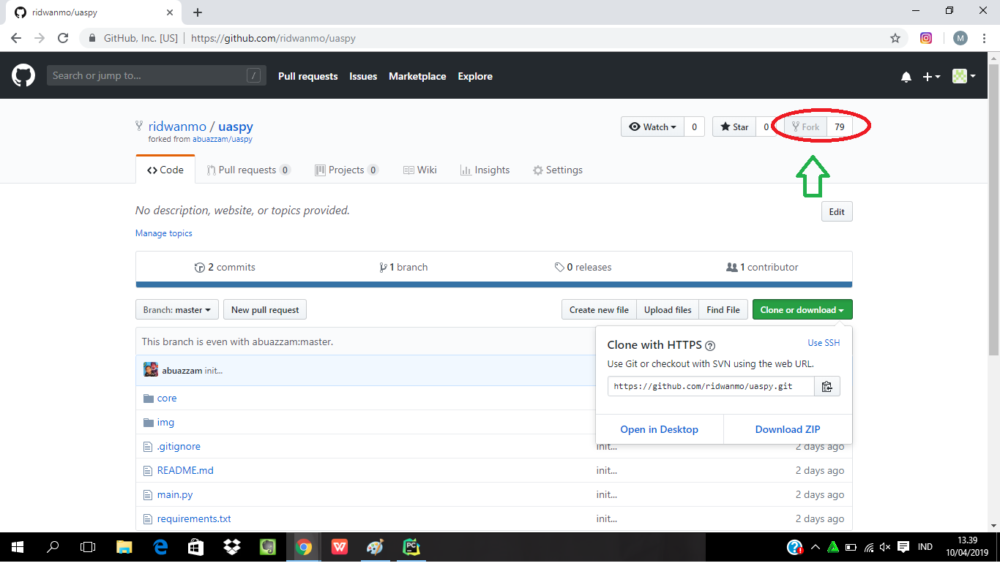
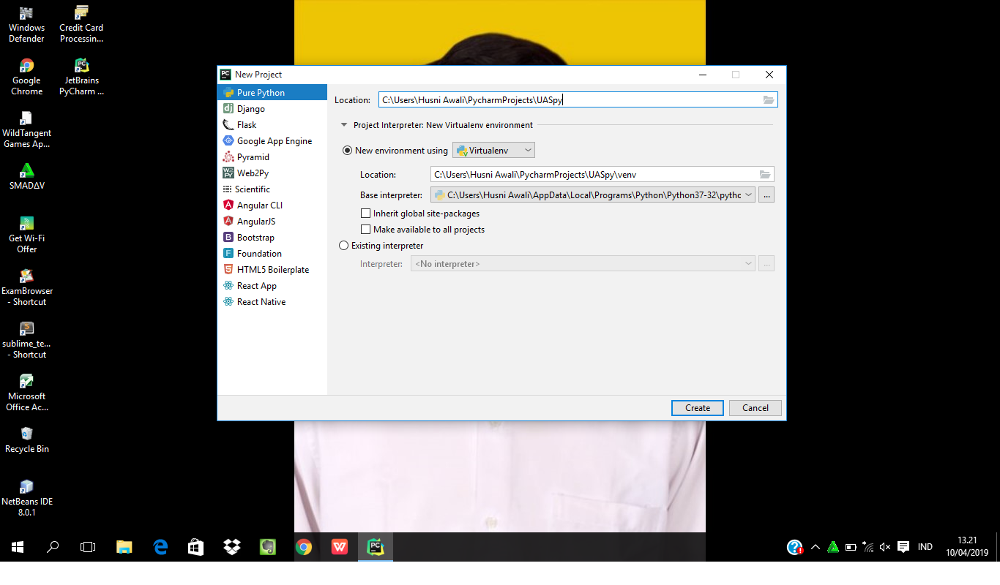
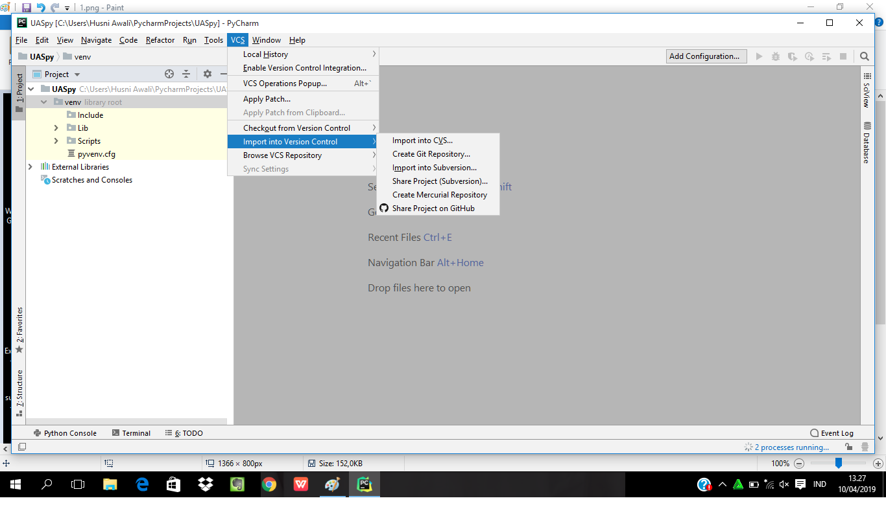
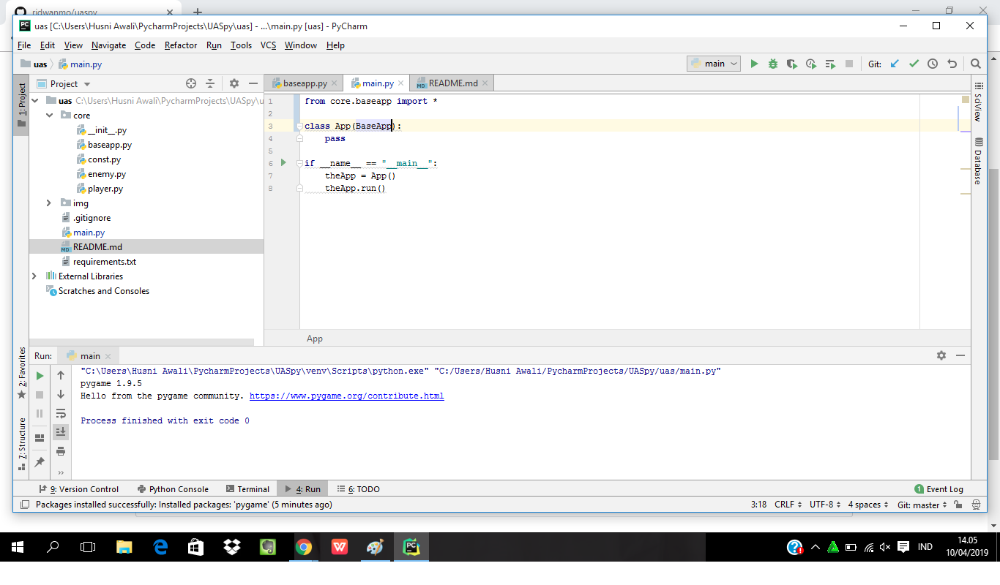
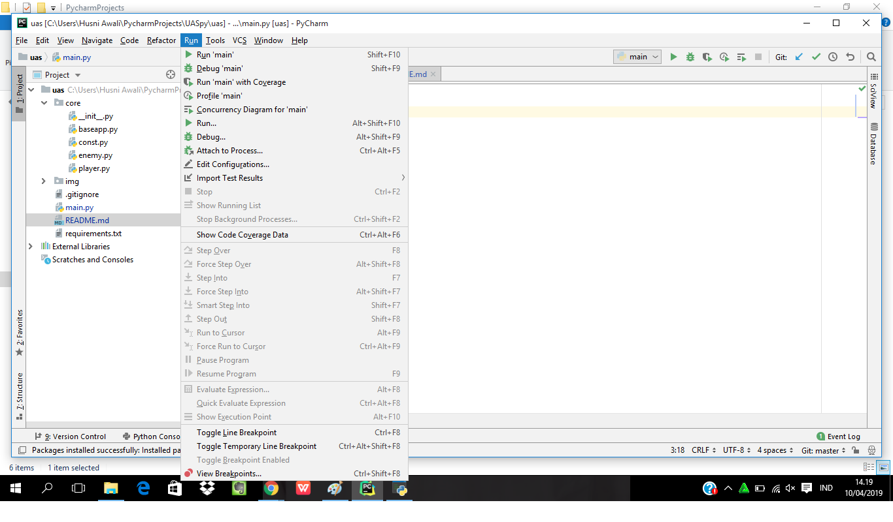
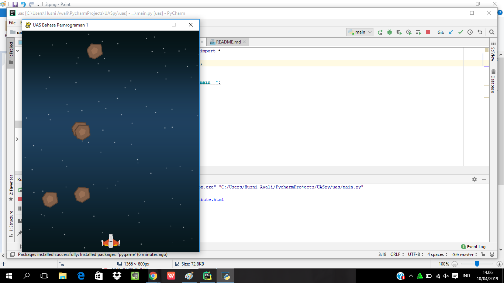

# UAS Bahasa Pemrograman 1

silakan tuliskan langkah-langkah disertai screenshotnya

#1. Buka github abuazzam lalu fork repository-nya

 

#2. Buka Pycharm,Buka Project baru lalu isi nama project-nya

#3. Kemudian klik VCS >> VCS POPUP >> Create git dan clone

#4. Ubah file main dengan perintah yang di minta

#5. Lalu Run 'main'

#6. Maka hasil nya seperti berikut

